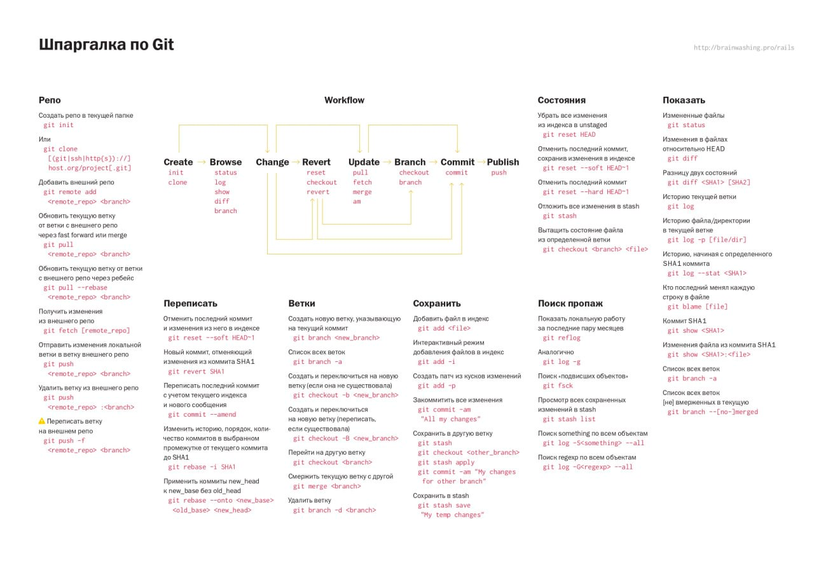
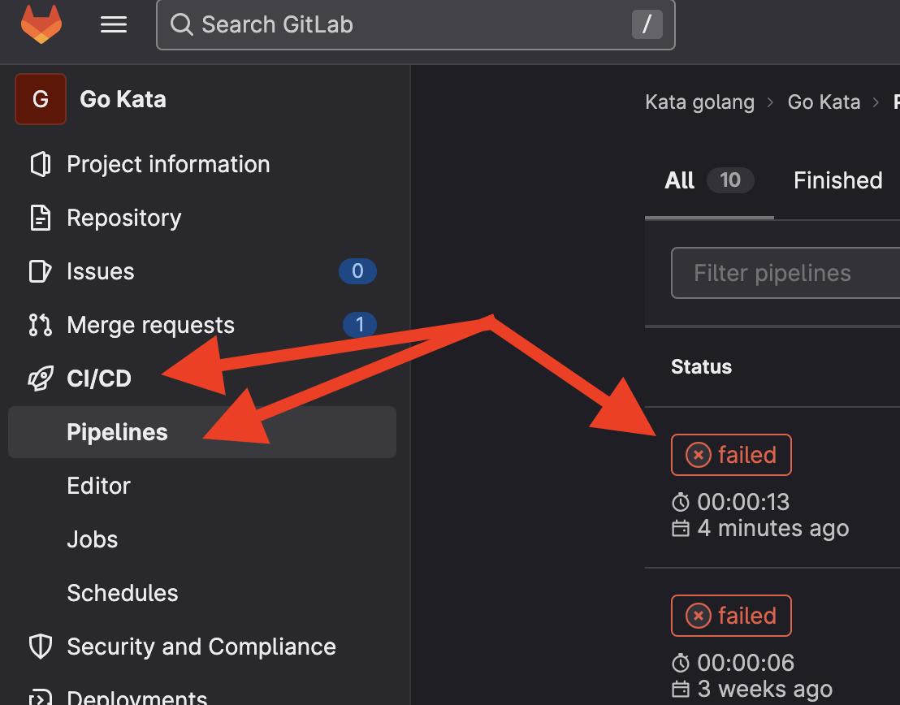
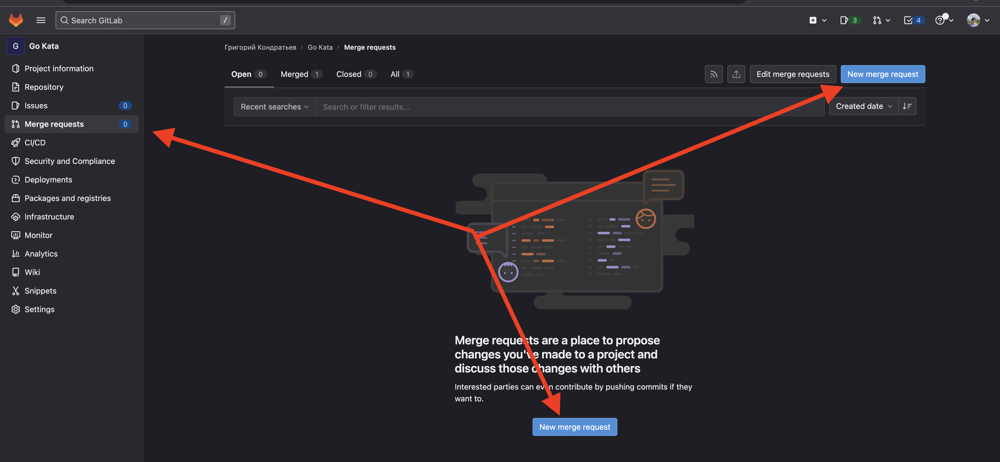

# Go Kata
> Внимание!
> Перед началом, нужно сделать fork данного репозитория в свой аккаунт.
> Далее пройти в Project information -> Members и добавить в проект участника `go-mentor` с правами `Maintainer`.

*** ЗАПРЕЩЕНО ВЫКЛАДЫВАТЬ РЕПОЗИТОРИЙ В ОТКРЫТЫЙ ДОСТУП! ***

*** В случае нарушения, студент будет исключен по пункту о списывании ***

> Сделайте git clone вашего репозитория в $GOPATH/src/studentgit.kata.academy/<your_username>/go-kata
> Инициализируйте модули в корне проекта `go mod init studentgit.kata.academy/<your_username>/go-kata 
> В репозитории должен присутствовать один файл go.mod и go.sum на весь проект

> Рекомендуемая версия golang - 1.19

В репозитории присутствует .gitlab-ci.yml, который запускает тесты при каждом push в репозиторий.

Если у вас возникают сложности с git, то вы можете потренироваться в [игре](https://learngitbranching.js.org/?locale=ru_RU).

А так же, посмотреть материалы с прошлого курса можно [здесь](https://go.ptflp.ru/course1/4/4.1/).



## Инструкция решения задач
1. Создайте ветку dev
2. Ведите разработку в ветке dev
3. Загрузи решение задачи в репозиторий
4. После завершения решения задачи создайте merge request в ветку main
5. Gitlab CI запустит тесты и проверит ваш код
6. Если тесты прошли успешно, то merge request будет принят
7. Смержите ветку dev в ветку main

## Результат приема задачи
Результат задачи вы можете посмотреть в меню CI/CD -> Pipelines


## Merge request


> Проверка задач будет вестись в ветке main, только в случае слияния ветки dev в ветку main.

> Внимание! В основном все решения нужно писать в файле main.go. Тесты нужно будет хранить в файле main_test.go.

## Тесты
После главы юнит тестирование, требуется писать тесты в файле main_test.go. Тесты должны быть табличными. Пример теста:
```go
func TestSum(t *testing.T) {
    tests := []struct {
        name string
        a, b int
        want int
    }{
        {
            name: "1 + 1 = 2",
            a:    1,
            b:    1,
            want: 2,
        },
        {
            name: "2 + 2 = 4",
            a:    2,
            b:    2,
            want: 4,
        },
    }

    for _, tc := range tests {
        t.Run(tc.name, func(t *testing.T) {
            got := Sum(tc.a, tc.b)
            if got != tc.want {
                t.Errorf("Sum(%d, %d) = %d; want %d", tc.a, tc.b, got, tc.want)
            }
        })
    }
}
```
Так же, будет проверка покрытия тестами, которая должна быть не менее 100%.

Генерируйте тесты в Goland, нажав на кнопку `Generate` в контекстом меню, при нажатии правой кнопкой мыши на функцию.

Для пользователей других IDE, воспользуйтесь библиотекой [gotests](https://github.com/cweill/gotests).

## Дополнительная информация
Старайтесь искать дополнительную информацию в гугл на английском языке. Вся информация и термины, которые вам понадобятся, будут на английском языке.

### Пример поиска
> Внимание! В яндексе вы ничего не найдете, поэтому используйте google.
1. Google: `golang length of string`
2. Google: `golang slice internals`
3. Google: `golang how to create api server`
4. Google: `golang interface internals habr` - для поиска по habr

## Дополнительные ссылки:
1. [go.ptflp.ru](https://go.ptflp.ru) - старые материалы курса
2. [go 101](https://go101.org/article/101.html) - книга по go
3. [go by example](https://gobyexample.ru/) - примеры кода на go
